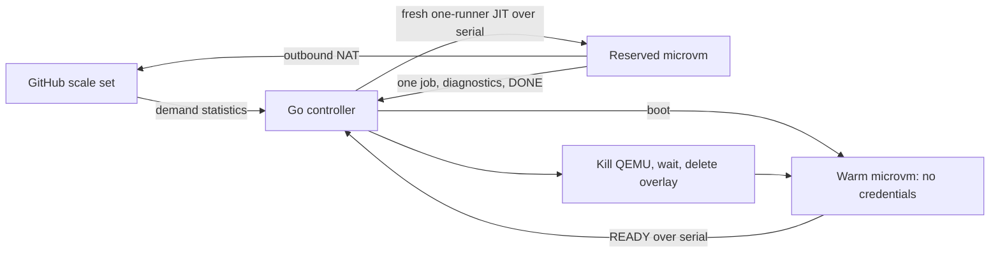

# chickadee

A small, self-hosted GitHub Actions runner pool for one Linux host. Each job gets an
independently booted QEMU `microvm` with KVM, an Ubuntu 24.04 filesystem, and a fresh
qcow2 overlay. Warm guests have no GitHub credentials and no runner registration.

**Working one-host prototype.** The real vertical slice has passed: preboot to
READY, fresh serial JIT, two real GitHub jobs on distinct runners, confirmed
process exit and disk deletion, and credential-free warm replacement. A trusted
main-branch push also built both binaries and passed the full test suite inside
an ephemeral VM. Warm-VM failure and idle controller-crash recovery were checked.
Clean Ubuntu install/reboot/uninstall and fuller adversarial network/restart
acceptance still remain. See [validation status](docs/validation.md).

Build with Go 1.26.3 on Linux amd64:

```sh
make build test
make image
```

Install on a dedicated Ubuntu 24.04 amd64 host by following
[installation](docs/install.md), including GitHub App setup. Installation only
copies files; applying networking and starting the service are explicit steps.
No repository publication or network changes are performed by building or testing.

The host uses the official [actions/scaleset Go client](https://github.com/actions/scaleset/tree/v0.4.0)
for GitHub App authentication, demand polling, acquisition, and JIT configuration.
The controller uses no Kubernetes, database, webhook receiver, Docker daemon,
snapshot, or VM suspension. Storage, serial sockets, logs, and the ownership
journal are local. One controller and one dedicated scale set own the installation.



GitHub chooses a matching job for an idle runner. VM creation does not bind a
particular workflow job. A JIT runner handles at most one job; a workflow with
several jobs uses several guests. Once credential generation begins, even an
ambiguous failure destroys that VM. Guest messages never authorize reuse.

See [architecture and trust model](docs/architecture.md),
[troubleshooting](docs/troubleshooting.md), and the manual
[two-job smoke workflow](examples/smoke.yml). A manual smoke workflow is installed for the plover-digital pilot; it runs only
on deliberate dispatch. The portable example can be copied into another target
repository after its pool is installed.

Development is open and commercially usable under [MIT](LICENSE). See
[contributing](CONTRIBUTING.md), the [public roadmap](docs/roadmap.md), and
[security status](SECURITY.md). Self-hosting has no dependency on a hosted service;
a future managed offering can operate the same public components.

For the smallest automatic loop, install once and opt into the
[push-to-build-and-test workflow](docs/push-to-test.md). Each trusted push then
requests a fresh job VM through GitHub's scale-set queue.

The [Exa primary-source audit](docs/research-audit.md) tracks design guidance and
remaining security gaps. The [plover-digital organization profile](docs/plover-digital.md)
documents our pilot without including credentials or private host details.

The [runner-platform comparison](docs/runner-platform-research.md) and
[selectable-profile design draft](docs/selection-design.md) cover the proposed
next step: different Linux image bundles and resource classes. These features
are not implemented by the current single-profile controller.
