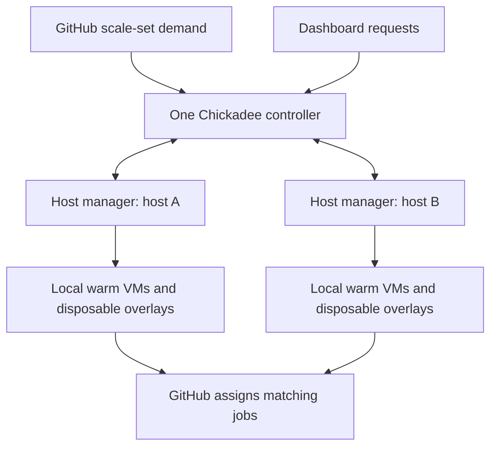

# Proposal: service manager and host managers

Status: design review, not implemented. The current release runs its VM fleet on
one Linux host. Adding a second machine requires a worker boundary, not a copy of
the existing configuration. This proposal uses the separate host and Roost repositories, Go binaries,
systemd and local disks; it adds no Kubernetes, shared filesystem, external
database or controller high availability.

## Manager responsibilities

Use **host manager** for the self-hostable runner engine on each physical VM
host, and **service manager** for the optional hosted-service layer. The host
manager creates VMs and launches runners; the service manager handles accounts,
App installations, customer queues, quotas, approvals, aggregated usage, future
billing and host routing. The proposed repository split is:

- `chickadee`: public host software, bootstrap, image builders, local VM lifecycle,
  standalone GitHub adapter and a versioned host API/client.
- `chickadee-roost`: the separate service-manager and website code, using the
  host API instead of importing QEMU or guest-bootstrap internals.
- `chickadee-ops`: private deployment configuration, customer policy and
  operations documentation; credentials remain outside Git repositories.

The service-manager component is named **Chickadee Roost**; the hosted website
remains `chickadee.run`. The website, OAuth and admission bridge have moved to the public
[Roost repository](https://github.com/plover-digital/chickadee-roost); the host API
and fleet routing remain planned. The host repository must never depend
on the service repository. Share only a small versioned protocol/client package,
not a common library containing customer state and VM execution code.

| Role | Owns in the hosted deployment | Does not receive |
| --- | --- | --- |
| Service manager | GitHub App credentials/listeners, customer scopes and queues, fleet-wide quotas, host placement, JIT creation, durable assignments and aggregated status/usage | Guest-controlled management commands |
| Host manager | Local image admission, warm guests, CPU/RAM/disk/TAP limits, QEMU, serial delivery, local deadlines, diagnostics and confirmed cleanup | GitHub App keys or customer OAuth tokens |

The existing optional website remains the login/dashboard layer. It sends
desired service state to the service manager; individual host managers never
process customer enrollment or publish competing dashboard snapshots.

Standalone operators run the host manager with a local GitHub adapter and their
own App configuration. That adapter polls demand and creates JIT through the
existing public Go client; no service-manager account or vendor API is required.
In hosted mode, the service manager runs the GitHub adapter once per queue and
supplies fresh JIT to host managers. The VM engine must not import customer
account, website or billing packages. Local and hosted adapters share the
runner-provisioning contract rather than duplicating the VM lifecycle.

Expose a small Go host-manager interface to the service manager, with inventory,
reserve-runner, prepare-credentials, configure-once, drain and reconcile
operations. The service manager selects a host; that host manager atomically
chooses and owns the actual VM. VM IDs are opaque ownership handles to the
service layer, never filesystem paths or QEMU commands supplied by customers.
Provide a local implementation for standalone users and an authenticated remote
implementation for fleets. Separate systemd units and identities are required
for fleet deployment so restarting the service manager leaves host jobs running.
The CLI/unit names are implementation work; these roles are not available as
commands in the current release.

## What stays stable

Users select `chickadee` or an explicit size/OS/version label. A GitHub queue is
identified by its installation, scope, runner group and scale-set identity. Its
physical host is a separate placement decision. GitHub assigns a matching job
after the runner connects; placement does not bind a VM to a particular job.

Each host keeps a small physical warm pool shared by all authorized customers.
Warm guests have no GitHub credentials. Images and overlays stay on that host's
local disk. No guest or writable disk moves between machines.



The controller alone owns GitHub listeners, App credentials, JIT creation,
customer policy, placement and fleet-wide accounting. Agents own their local
QEMU processes, serial sockets, TAP slots, overlays, deadlines and cleanup.
An outbound mutually authenticated TLS connection lets an agent reach a single
controller without opening a worker management port. Guest networking must not
grant access to management services. Host enrollment and certificates are
operator-controlled, not a public runner-provider signup.

## Placement

1. Resolve the requested queue to an immutable image digest and resource class.
2. Exclude draining, disconnected or unreconciled hosts; require the correct
   architecture, CPU features, image digest and local network readiness.
3. Prefer an existing compatible READY guest with no prior credential intent.
4. Otherwise reserve capacity on an eligible host and boot a fresh guest. Use
   deterministic first-fit packing with oldest waiting demand served first;
   host ID breaks ties. Sophisticated balancing is unnecessary for two hosts.
5. Enforce the customer quota across the fleet and CPU, memory, VM count, disk
   and TAP-slot limits on the selected host. Retiring and uncertain VMs still
   consume capacity. Agents enforce local limits even if the controller errs.

Compatibility uses content identity, machine type, CPU count, memory and disk,
not an absolute image path: the same bundle can live at different paths on
different machines. Image installation verifies the existing signed/checksummed
bundle out of band. A host cannot advertise a profile until installation and a
credential-free boot check pass. Image downloads do not belong in the job-start
path. Each host's memory budget must leave room for QEMU and the host OS.

GitHub acquisition also needs capacity coordination. Today each queue advertises
its configured maximum independently, even though multiple queues share one
host and customer quota. Physical VM limits prevent host oversubscription, but
accepted jobs can wait behind other queues. The multi-host scheduler must grant
bounded capacity across queues and report realizable capacity to GitHub; it
cannot simply advertise the sum of host limits to every queue. Per-queue
advertised capacity must also respect the customer concurrency quota.

## Reservation and credentials

Commands carry a protocol version, authenticated host ID, host boot generation,
controller generation, VM ID and reservation ID. Inventory and status are
bounded and treated as untrusted input. An authenticated host cannot impersonate
another host or choose a customer's GitHub scope.

The minimum state transition is:

```text
BOOTING -> READY -> RESERVED -> CREDENTIAL_INTENT -> RUNNING -> EXITED -> REMOVED
```

The controller durably records `(host, host generation, VM, reservation, scope,
queue, runner name)` before requesting JIT. The agent durably reserves that exact
VM and acknowledges it. A preparation command then records irreversible
credential intent on the agent before the controller generates and delivers
fresh JIT. Before the first serial write, the agent durably records that delivery
has been attempted. Neither journal stores JIT. A crash between that record and
the serial write conservatively spends the VM even if no credentials arrived.

Reservation retries are idempotent and report existing state. Configuration
retries never write credentials to serial again. If delivery or its ACK is
ambiguous, treat the VM as spent: retain its ownership and capacity until cleanup
is confirmed, reconcile the registration, and use a different fresh VM/JIT for
any later demand. A timeout alone is not proof that the remote QEMU exited.

One controller remains active. Agents accept only the enrolled controller's
current generation and reject stale commands; reconnect reconciliation must
fence old sessions before new reservations. Epoch numbers alone are not a lock
or a high-availability protocol. Automatic controller failover is deferred.

## Failure behavior

| Event | Required behavior |
| --- | --- |
| Agent heartbeat lost | Stop new placement on that host; retain uncertain allocations. |
| Controller connection lost | Existing credentialed guests finish within their local deadline; no new JIT is accepted until reconciliation. |
| Controller restarts | Recover its durable intents and reconcile agent inventories before acquiring new work. Do not reap remote jobs merely because the controller restarted. |
| Agent restarts or host reboots | Reap only owned local QEMU processes, confirm exit, preserve available diagnostics and remove overlays; report durable outcomes to the controller. |
| Lost reservation/configuration response | Query the same reservation. Never allocate the same VM to a different customer or replay JIT. |
| Disk/QEMU cleanup fails | Quarantine that allocation and retain capacity until exit/deletion can be established. |
| Host maintenance | Mark draining; finish credentialed jobs and remove warm guests before stopping the agent. |

The existing process-parent death and systemd cgroup behavior must move to the
agent service: a controller restart must not kill workers' QEMU processes. A
worker restart can retain the current conservative local reap-and-clean policy.
App keys stay off worker hosts. Agent authentication keys also need separation
from QEMU identities; the current shared controller/QEMU UID is not sufficient
for an untrusted multi-tenant service. Adding a host does not solve that isolation
gap or make an arbitrary external provider trustworthy.

## Audit of the current implementation

| Area | Current assumption | Required change |
| --- | --- | --- |
| `internal/github/client.go` | One listener/session for a scope's scale set | Keep ownership central; do not let workers poll GitHub. |
| `cmd/chickadee/runtime.go` | An active poller failure cancels the local pool | Isolate queue failures; preserve worker jobs during controller/listener outages. |
| `internal/pool/controller.go` | One local resource budget and integer TAP slot space | Track host-specific budgets and `(host, slot)` allocations; retain fleet-wide customer quotas. |
| `internal/host/vm.go` | Local paths, subprocess and serial socket | Extract a host-agent interface; reuse existing QEMU lifecycle locally. |
| `internal/host/journal.go` | Local VM ID and registration intent | Add host/generation/reservation ownership centrally and idempotent local command records. |
| `internal/pool/reload.go` | Queue changes within a fixed local catalog | Distinguish fleet policy updates from per-host capabilities and safe draining. |
| Roost `scripts/reconcile-site.py` | One controller's config and applied status | Continue one reconciler; workers must not independently update customer enrollment. |
| Host `internal/usage` and Roost `internal/site/services.go` | Local reservation intervals and latest scope snapshot | Deduplicate by host, generation and VM; publish one fleet aggregate per customer scope. |
| Roost `internal/site/usage.go` | Daily bounds based on at most 32 VMs | Use explicit bounded fleet/customer limits; do not remove validation. |

## Smallest implementation sequence

1. Extract a VM-host interface and run a local agent behind it on one machine.
   Preserve the current standalone self-host deployment path.
2. Add durable reservations, bounded authenticated agent transport, inventories,
   heartbeats, generation fencing and reconnect reconciliation. Separate the
   controller and agent service identities.
3. Add a second agent with verified images and local network setup. Begin with
   a credential-free READY/cleanup test, then an operator-owned real job.
4. Route matching demand between the two hosts; verify quotas and accounting
   before enabling ordinary customer jobs on the second host.

Acceptance must cover simultaneous requests at the capacity boundary, matching
READY preference, missing/wrong images, per-host and fleet/customer limits,
duplicate commands, lost configuration ACKs, stale controller generations,
network partitions, both restart directions, host drain, failed cleanup and
duplicate usage reports. Finally run real jobs on both hosts and confirm each
spent VM is destroyed after QEMU exit and replaced only with a fresh guest.

## Why not two copies of the current controller?

Our client looks up a scale set by runner group and name. Identical deployment
configurations therefore resolve the same set; local filesystem locks do not
coordinate listeners or resource accounting across machines.

GitHub documents an alternative for organizations: distinct scale sets with the
same name in different runner groups. Assignment between them is arbitrary and
cannot be configured. That can add independent organization-only capacity, but
it does not provide Chickadee-controlled placement, shared customer quotas or a
uniform personal-repository deployment. See
[GitHub's scale-set deployment guidance](https://docs.github.com/en/actions/how-tos/manage-runners/use-actions-runner-controller/deploy-runner-scale-sets#high-availability-and-automatic-failover).

The preferred design keeps one scale set per scope/queue and makes VM hosts an
implementation detail. It does not depend on custom label support: current
GitHub concept documentation and the standalone SDK README differ on that
feature. Keep the pinned SDK and existing labels while building the worker
boundary; verify any label/API migration separately against its exact version.
See the [official standalone client](https://github.com/actions/scaleset/tree/v0.4.0)
and [runner scale-set concepts](https://docs.github.com/en/actions/concepts/runners/runner-scale-sets).

Implementation and acceptance are tracked in
[public issue #11](https://github.com/plover-digital/chickadee/issues/11).
